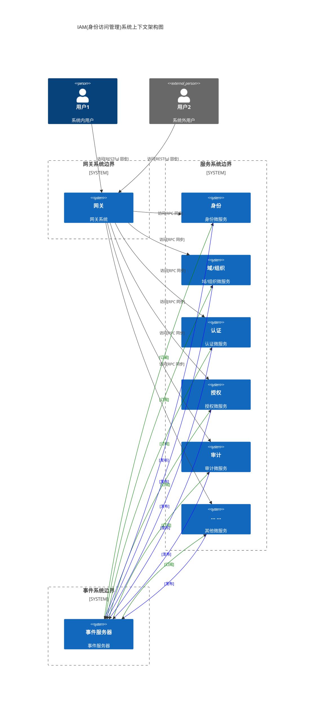

# 项目架构

iam-rs项目的整体架构如下图所示：

```mermaid
C4Context
    title IAM(身份访问管理)系统上下文架构图
    Person(c1, "用户1", "系统内用户")
    Person_Ext(c2, "用户2", "系统外用户")

    System_Boundary(g1, "网关系统边界") {
        System(Gateway, "网关", "网关系统")
    }

    System_Boundary(b1, "服务系统边界") {

        System(s1, "身份", "身份微服务")
        System(s2, "域/组织", "域/组织微服务")
        System(s3, "认证", "认证微服务")
        System(s4, "授权", "授权微服务")
        System(s5, "审计", "审计微服务")
        System(s6, "... ...", "其他微服务")
    }

    System_Boundary(b11, "事件系统边界") {
            System(se, "事件服务器", "事件服务器")
    }


    Rel(c1, Gateway, "访问[RESTful 同步]")
    Rel(c2, Gateway, "访问[RESTful 同步]")
    Rel(Gateway, s1, "访问[RPC 同步]")
    Rel(Gateway, s2, "访问[RPC 同步]")
    Rel(Gateway, s3, "访问[RPC 同步]")
    Rel(Gateway, s4, "访问[RPC 同步]")
    Rel(Gateway, s5, "访问[RPC 同步]")
    Rel(Gateway, s6, "访问[RPC 同步]")
    Rel(se, s1, "[订阅]")
    Rel(se, s2, "[订阅]")
    Rel(se, s3, "[订阅]")
    Rel(se, s4, "[订阅]")
    Rel(se, s5, "[订阅]")
    Rel(se, s6, "[订阅]")
    Rel(s1, se, "[发布]")
    Rel(s2, se, "[发布]")
    Rel(s3, se, "[发布]")
    Rel(s4, se, "[发布]")
    Rel(s5, se, "[发布]")
    Rel(s6, se, "[发布]")

    UpdateRelStyle(se, s1, $textColor="green", $lineColor="green", $offsetY="-200")
    UpdateRelStyle(se, s2, $textColor="green", $lineColor="green", $offsetY="-165")
    UpdateRelStyle(se, s3, $textColor="green", $lineColor="green", $offsetY="-125")
    UpdateRelStyle(se, s4, $textColor="green", $lineColor="green", $offsetY="-95")
    UpdateRelStyle(se, s5, $textColor="green", $lineColor="green", $offsetY="-65")
    UpdateRelStyle(se, s6, $textColor="green", $lineColor="green", $offsetY="-40")
    UpdateRelStyle(s1, se, $textColor="blue", $lineColor="blue", $offsetY="120")
    UpdateRelStyle(s2, se, $textColor="blue", $lineColor="blue", $offsetY="90")
    UpdateRelStyle(s3, se, $textColor="blue", $lineColor="blue", $offsetY="70")
    UpdateRelStyle(s4, se, $textColor="blue", $lineColor="blue", $offsetY="40")
    UpdateRelStyle(s5, se, $textColor="blue", $lineColor="blue", $offsetY="25")
    UpdateRelStyle(s6, se, $textColor="blue", $lineColor="blue", $offsetY="20")
```
